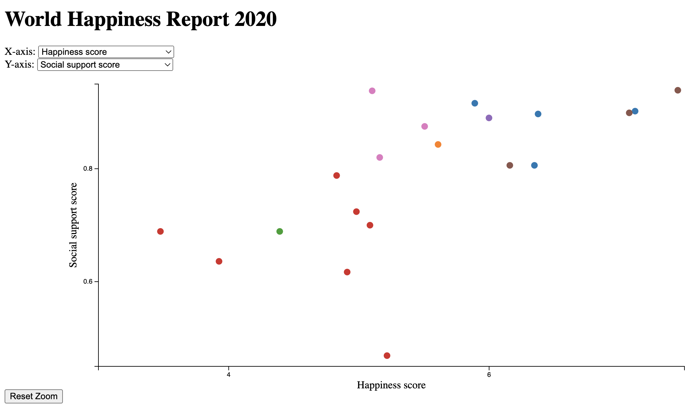
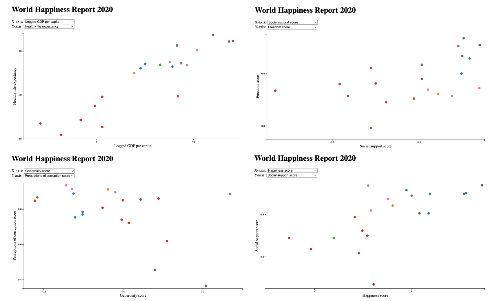
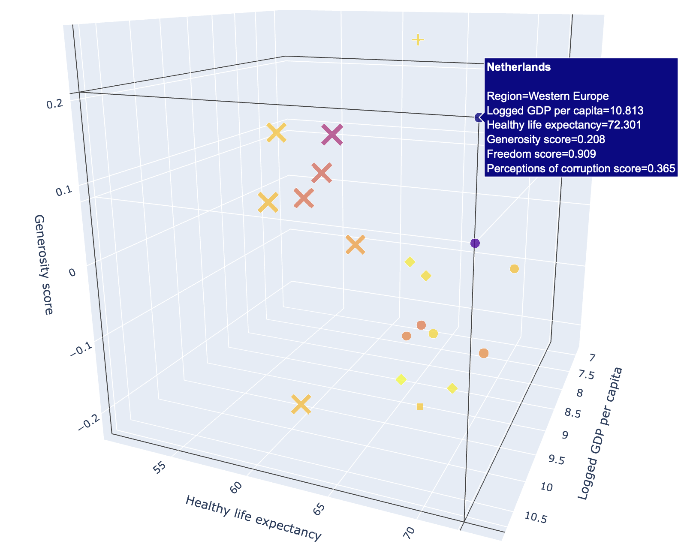
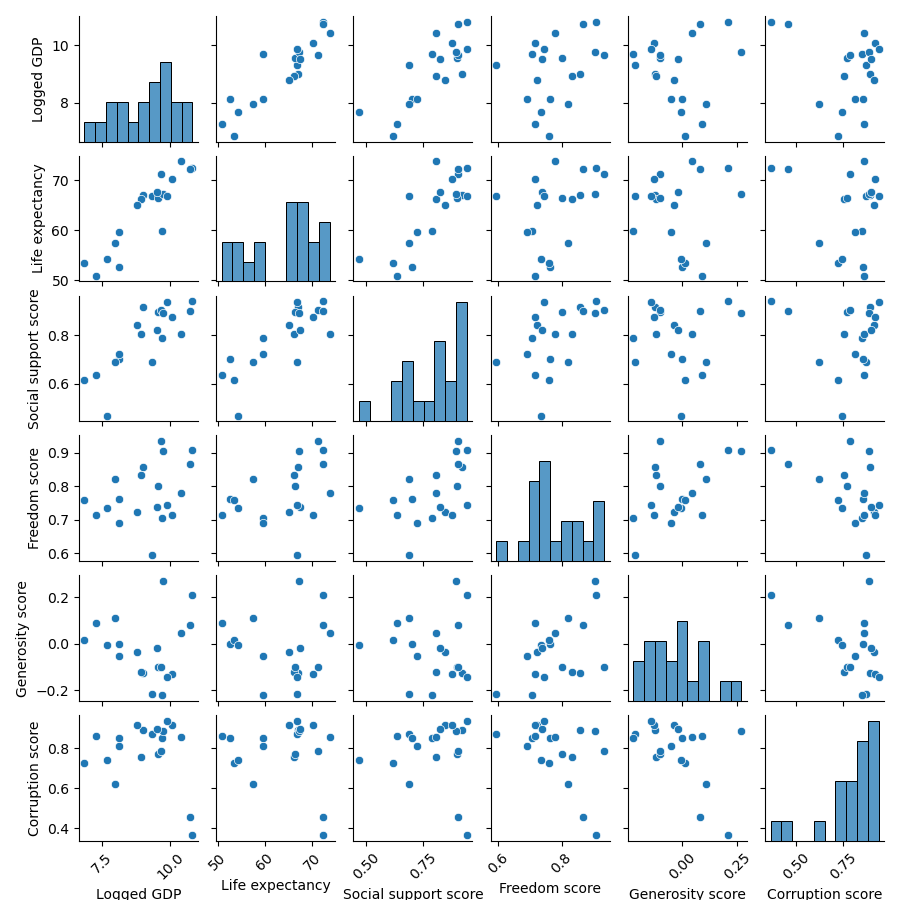
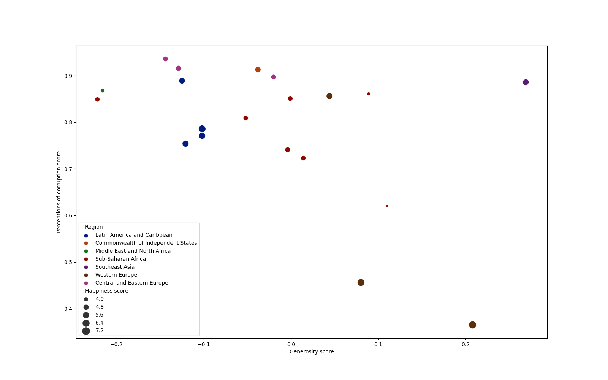
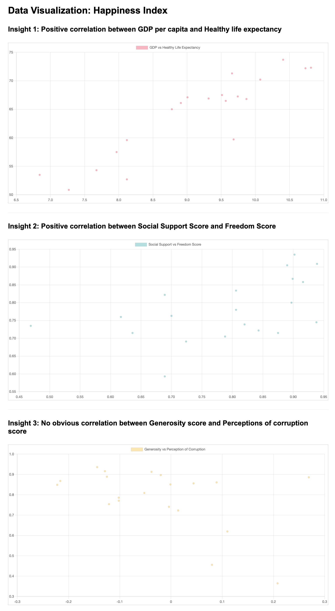
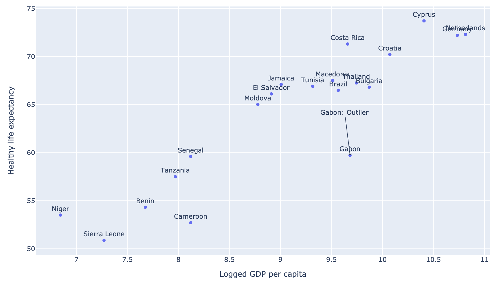

# Final Project

## Visualization Design

| File                                                                    |                Goal                 |
|:------------------------------------------------------------------------|:-----------------------------------:|
| [G4_VIS_Design.md](Visualization_Design/G4_VIS_Design.md)               | Generating basic Visualization code |
| [G4_VIS_Improvement_1.md](Visualization_Design/G4_VIS_Improvement_1.md) |   Improving functionality and UI    |
| [G4_VIS_Improvement_2.md](Visualization_Design/G4_VIS_Improvement_2.md) |       Adding hover (tooltip)        |
| [G4_VIS_Improvement_3.md](Visualization_Design/G4_VIS_Improvement_3.md) |             Adding zoom             |
| [G4_VIS_Improvement_4.md](Visualization_Design/G4_VIS_Improvement_4.md) |          Adding reset zoom          |

> Visualization designed and implemented by GPT 4. ([VIS_Design.html](./Visualization_Design/VIS_Design.html))

## Interaction with Visualization

| File                                                                              |                                                      Note                                                       |
|:----------------------------------------------------------------------------------|:---------------------------------------------------------------------------------------------------------------:|
| [G4_VIS_Interaction_1.md](Interaction_with_Visualization/G4_VIS_Interaction_1.md) | Dispatching events and interacting with VIS system in [VIS_Design.html](./Visualization_Design/VIS_Design.html) |
| [G4_VIS_Interaction_2.md](Interaction_with_Visualization/G4_VIS_Interaction_2.md) |                     no guidance; succeed in axis setting and zoom reset, failed in tooltip                      |
| [G4_VIS_Interaction_3.md](Interaction_with_Visualization/G4_VIS_Interaction_3.md) |                       implicit guidance; succeed in axis setting, zoom reset, and tooltip                       |
| [G4_VIS_Interaction_4.md](Interaction_with_Visualization/G4_VIS_Interaction_4.md) |                          explicit guidance; succeed in axis setting and naive zooming                           |
| [G4_VIS_Interaction_5.md](Interaction_with_Visualization/G4_VIS_Interaction_5.md) |                                explicit + implicit guidance; succeed in zooming                                 |

> Observations from interacting with VIS system ([VIS_Design.html](./Visualization_Design/VIS_Design.html)) by executing the JavaScript code in [G4_VIS_Interaction_1.md](Interaction_with_Visualization/G4_VIS_Interaction_1.md).

## Insight Discovery

Interacting with VIS system ([VIS_Design.html](./Visualization_Design/VIS_Design.html)) by executing the JavaScript code in [G4_VIS_Interaction_1.md](Interaction_with_Visualization/G4_VIS_Interaction_1.md), GPT 4 gained the following insights:

| File                                                           |                                               Note                                                |
|:---------------------------------------------------------------|:-------------------------------------------------------------------------------------------------:|
| [G4_VIS_Insights_1.md](Insight_Discovery/G4_VIS_Insights_1.md) |                                   Insights through observations                                   |
| [G4_VIS_Insights_2.md](Insight_Discovery/G4_VIS_Insights_2.md) |                                   Insights through observations                                   |
| [G4_VIS_Insights_3.md](Insight_Discovery/G4_VIS_Insights_3.md) | A report provided to the government of African developing countries to help their decision making |
| [G4_VIS_Insights_4.md](Insight_Discovery/G4_VIS_Insights_4.md) |                a report provided to the UN to assist their decision-making process                |
| [G4_VIS_Insights_5.md](Insight_Discovery/G4_VIS_Insights_5.md) |                           Reading materials for primary school students                           |

## Narrative Visualization

Given the insights in [G4_VIS_Insights_1.md](Insight_Discovery/G4_VIS_Insights_1.md) and raw data, GPT 4 generated the following narrative visualization:

| File                                                                   |                                  Examples                                   |
|:-----------------------------------------------------------------------|:---------------------------------------------------------------------------:|
| [G4 VIS Narrative 1.md](Narrative_Visualization/G4_VIS_Narrative_1.md) |      |
| [G4 VIS Narrative 2.md](Narrative_Visualization/G4_VIS_Narrative_2.md) |      |
| [G4 VIS Narrative 3.md](Narrative_Visualization/G4_VIS_Narrative_3.md) |  |
| [G4 VIS Narrative 4.md](Narrative_Visualization/G4_VIS_Narrative_4.md) |      |
| [G4 VIS Narrative 5.md](Narrative_Visualization/G4_VIS_Narrative_5.md) |      |

