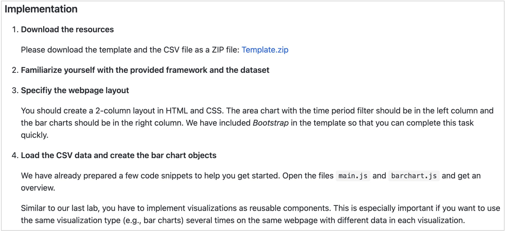

# Homework

> An example of the instructions in a programming homework.

## GPT3 / GPT4

These two folders ([GPT3](./GPT3) and [GPT4](./GPT4)) contain the all the materials GPT used and generated when working on the homework assignments week by week.

Among each week's folder, there are following folders and files:
- template: the homework template provided by teaching team
- upload: code generated by GPT, step by step
- output.json: GPT's output in json format
- prompt.py: the prompt used to generate the code

GPT3 means the GPT model used is `gpt-3.5-turbo`, and GPT4 means the GPT model used is `gpt-4`.

## To Grade

[This folder](./To%20Grade) contains all the homework assignments that are ready to be graded. 
The homework comes from two GPT models (GPT3 `gpt-3.5-turbo` and GPT4 `gpt-4`), and two students (H1 and H2).