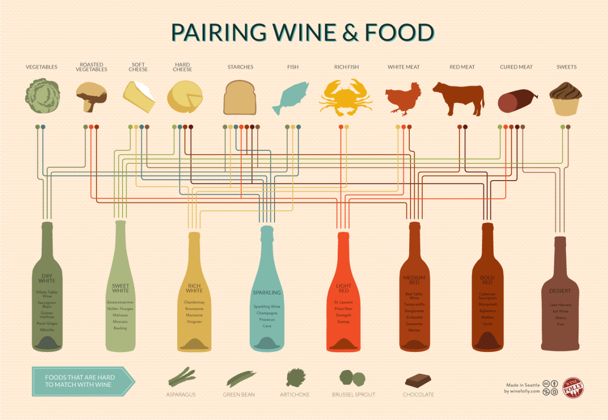

## 1) Design Critique 

Source: http://viz.wtf/image/162284459410

### Task 1.1: Critique

The 'How India Eats' visualization is aimed at a general audience interested in learning about food consumption patterns across different states in India. The objective of the design is to display the proportion of vegetarian and non-vegetarian diets across various states in India, shedding light on regional variations in food habits. The visualization tries to answer questions like: "What is the percentage of vegetarians across different states in India?", "Which states are predominantly vegetarian or non-vegetarian?", "How do food habits vary regionally within India?".

The design elements related to the objective include the use of India's map and the color-coded representation of diets in each state. The color scheme shows the vegetarian percentage from a scale of 0% to 100%, using shades from red for 0% to green for 100%. This allows the reader to get a quick overview of the prevailing food habits in each state.

The visualization has its strengths and weaknesses:

Positive aspects:
1. The use of a map provides a strong geographical context, allowing the reader to immediately recognize India and grasp the regional distribution of diets.
2. The color-coded representation is an effective way to visualize the data on a continuous scale from 0% to 100%. The choice of green for vegetarian and red for non-vegetarian is conventional and immediately understandable for the audience.
3. The title "How India Eats" is clear and informative, drawing the audience's attention to the subject matter and encouraging further exploration.

Negative aspects:
1. Labels are missing from the states, limiting the audience's ability to identify individual states and hindering understanding for those unfamiliar with India's geography. A key or a hover-over feature providing state names and exact percentages could enhance the visualization.
2. The continuous color scale makes it difficult to discern precise vegetarian percentages. A clearer legend might help, but the visualization might benefit from using discrete color categories for better differentiation.
3. The visualization lacks a clear source for the data, making it difficult for users to assess the credibility of the information presented.

Overall, the 'How India Eats' visualization achieves its primary objective by providing a quick overview of food habits across India. However, it could be improved in terms of labelling and state identification, as well as the clarity of the percentage scale. I like the visualization for its simplicity and at-a-glance understanding of regional variations in food habits, but believe that the negative aspects mentioned above limit its effectiveness and reliability.

## 2) Graphical Integrity, Gestalt Principles, C.R.A.P. Principles 

### Task 2.1: Graphical integrity

The visualization titled "The shrinking family doctor" appears to be a bar chart that represents the number of family doctors attending Harvard Medical School over the years from 1996 to 2006. Here is the evaluation of the chart based on Tufte's ideas:

a) Graphical Integrity: The chart seems to have a decent graphical integrity and accurately represents the data. The labels, axis scale, data representation, and context all seem to be consistent across the chart. One possible concern is the chosen y-axis scale (minimum of 10). Ideally, the y-axis should start at 0 to avoid exaggerating the differences between the bars.

b) Lie Factor: The chart appears to have a low lie factor. The percentage decline in the number of family doctors is presented accurately, without trying to mislead the viewers. However, starting the y-axis at 10 could lead to an inflated perception of the decline.

c) Data-Ink Ratio: The data-ink ratio could be improved substantially. There are some unnecessary elements in the chart that may not contribute to the information displayed. The gridlines behind the bars and the horizontal ticks on the x-axis are not necessary and add an extra element that might distract the viewer. The year labels alternating between the top and bottom of the x-axis could be made consistent and placed below the bars to maintain a simple layout. By removing excess elements, the chart can better emphasize the essential data.

d) Chart Junk: One notable chart junk is the way the year labels are displayed at the bottom of the chart. They alternate between being above and below horizontal ticks, which might cause confusion and distract from the main data. Also, the 3D effect on the bars can be considered chart junk, as it does not add any value or clarity to the chart.

To improve the data-ink ratio, the chart can be modified as follows:

1. Remove the gridlines and horizontal ticks on the x-axis.
2. Remove the 3D effect from the bars.
3. Make the year labels consistent and place them below the bars.
4. Consider starting the y-axis at 0 for an accurate representation of the data.

<!-- [url=https://ibb.co/ScsSfsn][img]https://i.ibb.co/G9xmHx2/cs171-hw7-infographic-1.png[/img][/url]
[url=https://ibb.co/F7n8WhB][img]https://i.ibb.co/0JQYXnf/cs171-hw7-infographic-2.png[/img][/url]
[url=https://ibb.co/vZX6RZw][img]https://i.ibb.co/Yp0FwpR/cs171-hw7-infographic-3.png[/img][/url]
[url=https://ibb.co/NszgW9y][img]https://i.ibb.co/qdwLmNr/cs171-hw7-infographic-4.png[/img][/url] -->

### Task 2.2: Gestalt principles

The 'Pairing wine & food' visualization effectively employs several Gestalt principles to organize and present information for an enjoyable user experience. Here are four prominent principles showcased in the design:

1. Proximity: Closely grouped elements are perceived as related, and this principle is well-utilized in the visualization. Different sections group together specific wines and their food pairings, forming distinct clusters for each wine variety. By grouping these items closely in each section, the viewer can quickly identify which foods best complement a particular wine.

2. Similarity: Similar elements or objects with shared characteristics are viewed as part of the same group. In this visualization, wine names and descriptions are displayed in the same font style, making it easy for viewers to differentiate wines from the listed food pairings. Moreover, each food pairing is represented by a distinct icon, reinforcing the connection between these items and their association with the corresponding wine.

3. Continuity: Elements that appear to follow a continuous line, pattern or curve tend to be perceived as related. The horizontal lines separating different wine varieties in the visualization serve to establish a sense of order and hierarchy. Additionally, the wavy line connecting the wine sections imparts a sense of fluidity and progression, providing a clear path for users to follow as they browse the chart.

4. Closure: Incomplete shapes or lines are perceived as complete, based on our brain's tendency to fill in missing information. While not explicitly drawn, invisible boundaries are perceived between different wine sections, resulting from the carefully maintained spaces between clusters. This principle helps the viewer mentally divide the visualization into distinct sections, focusing attention on each wine and its food pairings.

In summary, the 'Pairing wine & food' visualization effectively leverages Gestalt principles of proximity, similarity, continuity, and closure to create an organized, visually appealing, and user-friendly experience for viewers seeking guidance in matching wines with various dishes.

Source: https://laurenadhav.wordpress.com/2014/02/15/data-visualization-critique/

### Task 2.3: C.R.A.P. design principles

The C.R.A.P. principles are an acronym for Contrast, Repetition, Alignment, and Proximity, which are all essential components of an effective and visually appealing design. These principles ensure that the design is aesthetically pleasing, allowing the viewer to quickly grasp the essential information presented in a clear and concise manner.

1. Contrast: Contrast involves using different sizes, shapes, and colors to create a visual distinction between various elements within a design. In the OECD well-being visualization, contrast is utilized through the use of distinct colors to represent different regions, allowing users to easily distinguish between them. Moreover, the use of bold typography in headings and labels helps separate categories and topics, facilitating quick and effortless understanding.

2. Repetition: This principle refers to the consistent application of styles and elements throughout a design, creating a sense of visual unity and cohesion. In the OECD well-being visualization, the repetition is employed consistently in color schemes for individual regions, as well as the consistent use of font styles and sizes across the website. This repetition ensures that the user can easily navigate through the site and quickly recognize patterns, enhancing the overall user experience.

3. Alignment: Alignment entails organizing elements in a design to create a sense of order and balance, which in turn allows for easier comprehension. The OECD visualization incorporates alignment through the structured layout of the website, with elements such as the header, sub-headings, and main content area clearly demarcated within a grid system. This orderly alignment allows the user to navigate seamlessly throughout the site and find relevant information with ease.

4. Proximity: Proximity deals with the arrangement of related elements and grouping them together to create a sense of connection and organization. In the context of the OECD well-being visualization, proximity is evident in how the content is structured, with related data sets and topics being placed near each other. This clustering effectively conveys the relationships between different aspects of wellbeing, enabling users to make better sense of the complex data being presented.

By skillfully applying the C.R.A.P. design principles, the OECD well-being visualization achieves an effective and engaging design that allows users to quickly and easily comprehend important information about regional well-being, providing a seamless experience for anyone exploring the rich data provided on the website.

Source: http://www.oecdregionalwellbeing.org/

## 3) Visual Vocabulary, Visual Channels

### Task 3.1: Sugar content in foods over time

For Task 3.1, I choose Line Charts and Stacked Bar Charts as my top 2 visual encodings.

#### Visual Encoding 1: Line Chart

Questions to answer:
- How has the sugar content in each food group evolved over time?
- Are there any trends, patterns, or turning points in the sugar content of certain food groups?

Assumed data:
- Year (independent variable): Time data from 1950 to present
- Food groups (categorical variable): Cereal, bread, etc.
- Sugar content (dependent variable): Ideally, we should have the mean sugar content values for each food group per year

Why choose this visual encoding:
- A line chart is effective in displaying continuous data over time and provides a quick understanding of trends, patterns, and comparisons between food groups over time.

How to encode the data:
- Marks: Lines
- Channels: Horizontal axis (year), Vertical axis (sugar content), Color (food groups)

#### Visual Encoding 2: Stacked Bar Chart

Questions to answer:
- How does the total sugar content change across different food groups and over time?
- What is the contribution of each food group to the total sugar content in various years?

Assumed data:
- Same as in Line Chart

Why choose this visual encoding:
- Stacked bar charts effectively show part-to-whole relationships between various categories.

How to encode the data:
- Marks: Rectangles (bars)
- Channels: Horizontal axis (year), Vertical axis (sugar content), Color (food groups)
