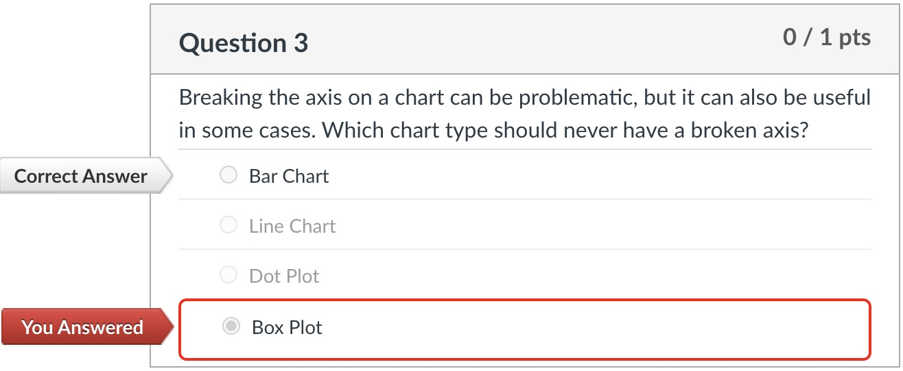

# Quiz

> an example of a single-choice question in a quiz.

## Directory Structure

- [code](./code): The code for data processing, chat completion and grade evaluation.
  - [clean.py](./code/clean.py): Clean the raw exported data.
  - [grading.py](./code/grading.py): Evaluate the grade of each question.
  - [prompts.py](./code/prompts.py): Chat completion for each question.
  - [summary.py](./code/summary.py): Generate summary for each GPT model and quiz type.
  - [XML_to_QA.py](./code/XML_to_QA.py): Convert XML to QA format.

- [compsci-171-visualization-quiz-export](./compsci-171-visualization-quiz-export): The raw data of quiz.
  - *This part is not included in this repo, since it contains raw data of the course.*

- [data_by_week](./data_by_week): The processed data of weekly quiz, including:
  - `answers`: answers for each question, from different GPT model, `iter` times of iteration.
    - eg. `G3-iter10` means answers from GPT3.5, 10 iterations (attempts) for each question.
  - `items`, `assessment_meta.xml`, `data_meta.xml`: meta data
  - `quiz_report-G*.md`: grade summary for GPT*. (Same as __*Results*__ below)
  - *This part is partially included (only two weeks for demonstration) in this repo, since it contains raw data of the course.*

- [examples_by_type](./examples_by_type): Some examples of our QA process, including all typical question types:

    |                           |         GPT3          |        GPT4       |
    |:-------------------------:|:----------------------:|:--------------------:|
    | matching question         | [1](./examples_by_type/GPT3/matching_question_1.md), [2](./examples_by_type/GPT3/matching_question_2.md) | [1](./examples_by_type/GPT4/matching_question_1.md), [2](./examples_by_type/GPT4/matching_question_2.md) |
    | multiple answers question | [1](./examples_by_type/GPT3/multiple_answers_question_1.md), [2](./examples_by_type/GPT3/multiple_answers_question_2.md) | [1](./examples_by_type/GPT4/multiple_answers_question_1.md), [2](./examples_by_type/GPT4/multiple_answers_question_2.md) |
    | multiple choice question  | [1](./examples_by_type/GPT3/multiple_choice_question_1.md), [2](./examples_by_type/GPT3/multiple_choice_question_2.md) | [1](./examples_by_type/GPT4/multiple_choice_question_1.md), [2](./examples_by_type/GPT4/multiple_choice_question_2.md) |
    | true false question       | [1](./examples_by_type/GPT3/true_false_question_1.md), [2](./examples_by_type/GPT3/true_false_question_2.md) | [1](./examples_by_type/GPT4/true_false_question_1.md), [2](./examples_by_type/GPT4/true_false_question_2.md) |

## How to Run

1. Run `python prompts.py` to generate chat completion for each question.
2. Run `python summary.py` to generate summary for each GPT model.

## Quizzes and Grades

### Quiz Info

**Post-Lecture Quiz**: 10 quizzes, 47 questions in total.

**Pre-Quiz (Lab)**: 10 quizzes, 44 questions in total.

### Grades

  - [Post-Lecture Quiz Report-G3.md](./Grade_Report/Post-Lecture%20Quiz%20Report-G3.md)
  - [Post-Lecture Quiz Report-G4.md](./Grade_Report/Post-Lecture%20Quiz%20Report-G4.md)
  - [Pre-Quiz (Lab) Report-G3.md](<./Grade_Report/Pre-Quiz (Lab) Report-G3.md>)
  - [Pre-Quiz (Lab) Report-G4.md](<./Grade_Report/Pre-Quiz (Lab) Report-G4.md>)

|              |      Post-Lecture      |    Pre-Quiz (Lab)    |
|:------------:|:----------------------:|:--------------------:|
|      G3      | 30.03/48.0 (62.56/100) | 4.3/5.5 (78.18/100)  |
|      G4      | 39.82/48.0 (82.96/100) | 5.03/5.5 (91.45/100) |

### Metrics Note

- `Score`: The score of each question.
- `Scale_100`: The _scaled score_ (0-100) of each question.
- `Total Score`: The total quiz score of this GPT model.
- `Average Scale_100`: The average _scaled score_ (0-100) of this GPT model.